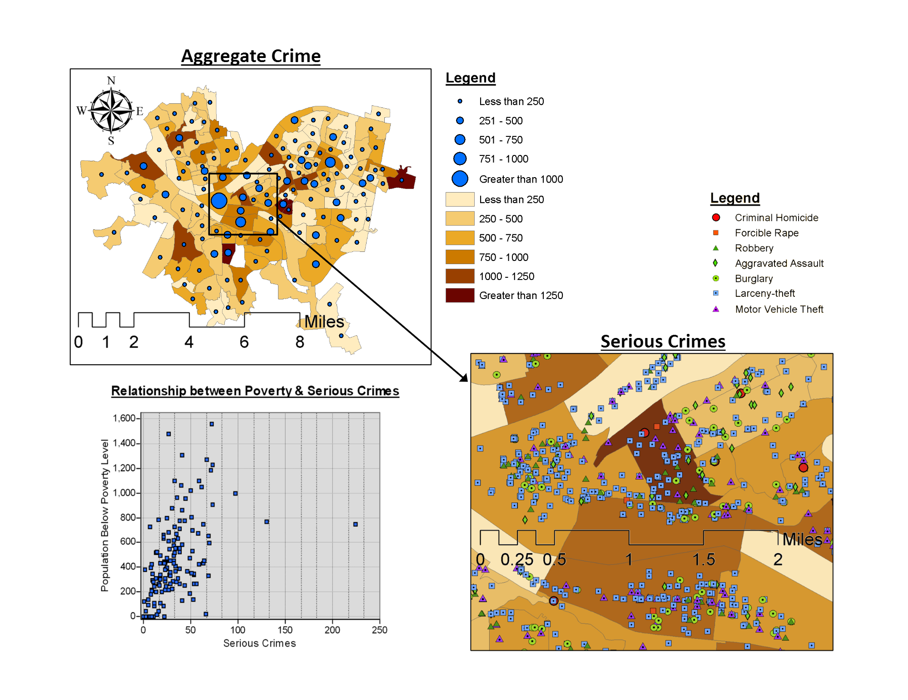

###Your original plot

###Comments
Nice plots! My suggetions as follow :)

1. Change the position of maps. How about putting two maps togeter horizontally or vertically?
2. Use a gray scale color to cholopleth map. 
3. And maintain blue dots and without outline.
4. If possible, modify the symbols of zoom-in map plot. Unify the shape and just use different vivid color.
5. Scale up the scatter plot.
6. Use white background for scatter plot (New scatter plot by using python will looks better).
7. Make one representative title of whole plots.

Good luck!
