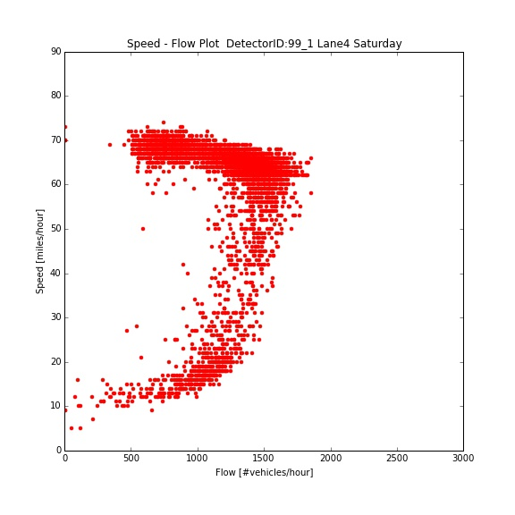

<Your original plot>

<Comments>
I really like your content of plot and representation method (dots or scatter). My suggetions as follow :)

1. Modify title: make bigger title and make subtitle including details (lane information etc.) seperatly.
2. Make bigger axis labels
3. Add thousand separators for y-axis labels to make numbers more readable
4. I think change of the range of axis is better to show attributes.(x axis: 0-2000, y axis: 0-80)
5. Modify(decrease) dot size of scatter plot
6. If possible, add inner grid. It would be helpful to understand concentration data pattern.

Good luck!
